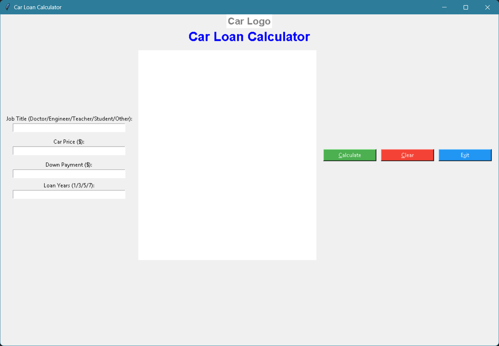

# Car Loan Calculator Application

A user-friendly desktop application for calculating monthly car loan payments. This tool helps users estimate their car loan costs by entering their job title, car price, down payment, and loan term. **The application is built using Python's Tkinter GUI library**, providing a clear breakdown of loan calculations and robust input validation.

---

## Features

- **Intuitive GUI:** Simple and clean interface for easy data entry and results viewing.
- **Flexible Inputs:** Supports job titles (Doctor, Engineer, Teacher, Student, Other) and loan terms (1, 3, 5, or 7 years).
- **Automatic Interest Rate Selection:** Applies the correct interest rate based on the chosen loan term.
- **Detailed Calculation Summary:** Step-by-step breakdown of loan amount, interest, and monthly payment.
- **Input Validation:** Ensures all fields are filled correctly and provides helpful error messages.
- **Logo Support:** Displays a car logo if `Car_logo.png` is present, or a placeholder text if not.
- **Clear and Exit Buttons:** Easily reset the form or close the application.

---

## Installation

1. **Clone the repository:**
   ```sh
   git clone https://github.com/yourusername/car-loan-calculator.git
   cd car-loan-calculator
   ```

2. **Install dependencies:**
   - Ensure you have Python 3.x installed.
   - Install required packages:
     ```sh
     pip install pillow
     ```

3. **(Optional) Add a logo:**
   - Place a `Car_logo.png` image in the project directory for a custom logo.

---

## Usage

1. **Run the application:**
   ```sh
   python GUI_Car_App.py
   ```

2. **Enter your details:**
   - **Job Title:** Doctor, Engineer, Teacher, Student, or Other
   - **Car Price:** Enter the car price in dollars
   - **Down Payment:** Enter your down payment in dollars
   - **Loan Years:** Choose 1, 3, 5, or 7

3. **Click "Calculate":**
   - View a detailed summary of your loan calculation and monthly payment.
   - Receive feedback on whether your monthly payment is affordable.

4. **Clear or Exit:**
   - Use the "Clear" button to reset all fields.
   - Use the "Exit" button to close the application.

---

## Example



---

**Note:** If `Car_logo.png` is not found, the application will display a text placeholder instead of the logo.